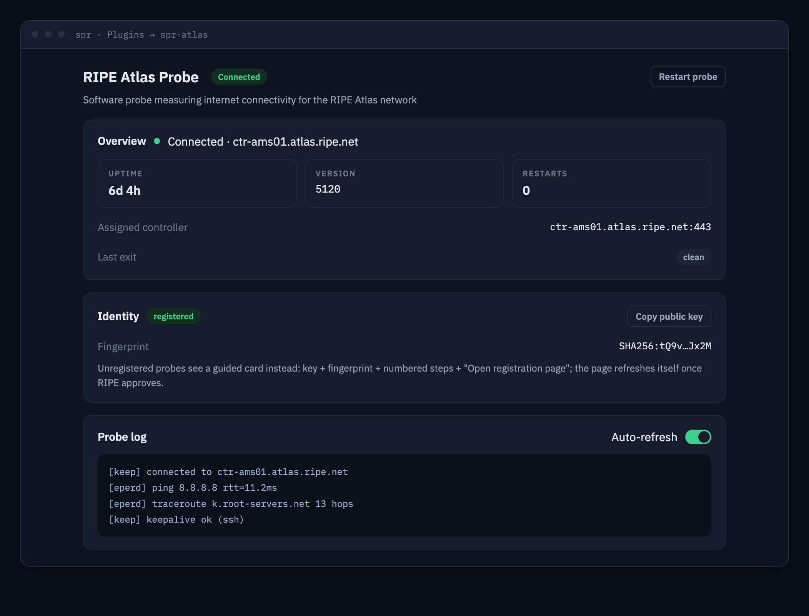

# spr-atlas



Run a [RIPE Atlas](https://atlas.ripe.net/) **software probe** on your SPR
router. RIPE Atlas is the RIPE NCC's global internet measurement network:
hosting a probe contributes ping/traceroute/DNS/TLS measurements from your
network vantage point and earns you credits to run your own measurements.

## About

The plugin builds the official
[RIPE-NCC/ripe-atlas-software-probe](https://github.com/RIPE-NCC/ripe-atlas-software-probe)
from source at a pinned release, runs it in a KVM microVM using
[libkrun](https://github.com/containers/libkrun), and adds a small Go backend
+ React UI (rendered by SPR as an iframe under Plugins) for status,
registration and logs. The VM's virtio-net device is backed by `kruntap0`
inside its private OCI network namespace. An internal kernel bridge connects
that TAP to Docker's veth and the host's dedicated `spr-atlas` bridge. SPR
CoreDHCP assigns the stable VM MAC a normal tiny-subnet lease and applies the
declared `wan` + `dns` device policies. The microVM boots the
full Linux kernel bundled by
[libkrunfw](https://github.com/containers/libkrunfw), independently of the
host's page size. Its final image inherits
[`spr-krun-plugin`](https://github.com/spr-networks/spr-krun-plugin), which supplies the reusable
minimal vsock-to-Unix bridge entrypoint. libkrun's embedded init obtains the
SPR DHCP lease before Atlas starts.

On first start the probe generates an RSA ssh keypair — its permanent
identity. You (the admin) register the **public** key at
<https://atlas.ripe.net/apply/swprobe/>; the UI shows the key with a copy
button and step-by-step instructions. Once RIPE approves the application the
probe connects to its assigned controller automatically (outbound ssh over
port 443). The key is stored under `state/plugins/spr-atlas/etc/` so it
survives container rebuilds and plugin upgrades.

## Features

- RIPE Atlas software probe (latest production release, built from source,
  pinned by commit hash)
- Interface traffic-statistics reporting explicitly enabled (`RXTXRPT=yes`)
- IPv4 startup reachability check over the SPR DHCP-backed TAP
- Registration card: probe public key + fingerprint, copy button, link to the
  RIPE application form
- Status card: probe process state, uptime, controller connection heuristic,
  assigned controller, firmware version
- Sanitized probe log tail in the UI (severity-tinted, optional auto-refresh)
- Probe restart behind a confirmation dialog
- Contributes the assigned Atlas controller to SPR's topology view
  (`HasTopology` + `GET /topology`)
- Probe identity persisted under `state/plugins/spr-atlas/` (survives
  rebuilds)

## UI Setup

1. Install the host's `spr-krun-runtime` Debian package once, as described under
   [Command Line Setup](#command-line-setup).
2. In the SPR UI, go to **Plugins** → `+ New Plugin` and add
   `https://github.com/spr-networks/spr-atlas`.
3. Open **spr-atlas** at the bottom of the left-hand menu.
4. Copy the probe public key from the Registration card and submit it at
   <https://atlas.ripe.net/apply/swprobe/> (requires a free RIPE NCC Access
   account; software probes are always public probes).
5. Wait for approval — the status dot turns green once the probe is connected
   to a controller. No further configuration is needed.

## Command Line Setup

The host needs ARM64 KVM and the generic `spr-krun` OCI runtime:

```bash
test -c /dev/kvm
```

The runtime is a versioned release asset from
[`spr-networks/super`](https://github.com/spr-networks/super/releases).
Install or upgrade that host package, then verify KVM:

```bash
sudo apt-get install ./spr-krun-runtime_*_arm64.deb
test -c /dev/kvm
```

The package installs pinned `libkrunfw`, patched `libkrun`, and patched crun
under private package paths. It merges only the `spr-krun` entry into Docker's
existing configuration and reloads Docker without rebooting the host or
restarting running containers.

`spr-krun` carries small, auditable patches that create a dedicated TAP and
kernel bridge inside each plugin's private OCI network namespace and configure
a direct host Unix-socket-to-guest-vsock mapping, plus a libkrun patch that makes its
embedded DHCP client reliable with an external router. `passt` is not
installed or started.
SPR remains the DHCP server, router, DNS policy point, and firewall for all
guest traffic, including Atlas DNS, SSH, ICMP, and traceroute.

Confirm Docker sees it:

```bash
docker info --format '{{json .Runtimes}}' | grep spr-krun
```

Then use the SPR UI, or install from the command line:

```bash
./install.sh   # prompts for the SUPER dir and an SPR API token
```

The script builds the image, starts the microVM, registers its stable MAC as
an SPR device with `wan` + `dns` policies, waits for its SPR DHCP lease, and
prints the probe public key to register.

Run the end-to-end host check after installation:

```bash
sudo ./test_krun.sh /home/spr/super/
```

It verifies the KVM runtime, direct UDS-to-vsock API path with no IP listener,
host-visible plugin socket/API, and the probe's DNS + raw-ICMP registration
check from this boot.

`plugin.json` declares `"Runtime": "kvm"`, so superd selects
`docker-compose-kvm.yml`.
`docker-compose.yml` contains the shared service definition and private plugin
network inherited by the KVM deployment.
`docker-compose-gvisor.yml` remains for compatible 4 KiB hosts, but gVisor
cannot run on the 16 KiB ARM64 kernel used by the tested SPR router.

## API

All endpoints are served over the host-visible plugin Unix socket
(`/state/plugins/spr-atlas/api/socket.sock`) and proxied by SPR under
`/plugins/spr-atlas/`.

Inside the microVM, the `spr-krun-plugin` bridge listens on virtio-vsock port
4040 and forwards the byte stream to Atlas's guest-local Unix socket.
`spr-krun` asks libkrun to create the real host Unix socket and map accepted
connections to that vsock listener. There is no TCP/UDP API listener, TCP
proxy, sidecar, or Docker-published port.

| Method | Path       | Description                                                                                             |
| ------ | ---------- | ------------------------------------------------------------------------------------------------------- |
| GET    | `/status`  | Probe state: `Running`, `PID`, `ProbeID`, `UptimeSeconds`, `Restarts`, `Registered`, `Connected`, `ControllerHost`, `KeyExists`, `Fingerprint`, `Version` |
| GET    | `/key`     | Probe **public** key + SHA256 fingerprint + registration URL (public keys are safe to show)              |
| POST   | `/restart` | Restart the probe process tree                                                                           |
| GET    | `/logs`    | Sanitized tail of the probe log, `{"Lines": [...]}`; optional `?lines=1..1000` (default 200)            |
| GET    | `/topology` | Plugin topology graph `{"Nodes": [...], "Edges": [...]}` merged into SPR's topology view (see below)   |

`Connected` is a heuristic from the probe's own state files: registration
state present (`reginit.vol`) and the ssh keepalive session to the controller
alive (`con_keep_pid.vol`).

### Topology

The plugin sets `HasTopology` in `plugin.json` and contributes a small graph
to SPR's router topology view: a root anchor node (`ConnType: "atlas"`) plus,
once the probe is registered, one node for the assigned RIPE Atlas controller
(`Kind: "controller"`, named after the controller host, online while the
keepalive ssh session is up) connected to root by a `wan`-layer edge. When the
probe is unregistered or down the graph is just the root anchor.

## Configuration

There is nothing to configure for a standard probe. Installing the plugin is
treated as explicit consent to RIPE Atlas interface traffic-statistics
reporting, so startup persistently sets `RXTXRPT=yes` in
`/etc/ripe-atlas/config.txt`. Probe state lives in:

| Host path                              | In container            | Purpose                                    |
| -------------------------------------- | ----------------------- | ------------------------------------------ |
| `state/plugins/spr-atlas/etc/`         | `/etc/ripe-atlas`       | probe ssh keypair, mode, reg servers       |
| `state/plugins/spr-atlas/spool/`       | `/var/spool/ripe-atlas` | measurement spool/crontabs                 |
| `state/plugins/spr-atlas/log/`         | —                       | captured probe log (size-capped)           |
| `state/plugins/spr-atlas/api/socket`   | libkrun ↔ vsock 4040 ↔ guest UDS | host-visible SPR plugin API socket |
| `configs/plugins/spr-atlas/api-token`  | —                       | SPR API token written at install (unused by the backend today) |

To reset the probe identity (new probe application), stop the plugin and
delete `state/plugins/spr-atlas/etc/probe_key*`; a new keypair is generated on
the next start.

## Security model

- **No IP API socket.** SPR reaches the backend only through the dedicated
  host Unix socket and libkrun's virtio-vsock mapping. The API has no TCP/UDP
  listener, proxy sidecar, or Docker-published port. The probe makes
  **outbound-only** network connections: ssh to RIPE
  registration/controller servers on port 443, plus the measurements
  themselves.
- **Full guest kernel under KVM.** `docker-compose-kvm.yml` selects crun's
  libkrun handler. Atlas runs in the Linux kernel bundled by libkrunfw, while
  the OCI root filesystem and persistent state are presented through
  virtiofs. Its TAP is bridged into the private `spr-atlas` Docker network; it
  does not share SPR's host network namespace. On a 16 KiB ARM64 host the guest
  still uses 4 KiB pages.
- **Direct TAP, no userspace network stack.** Atlas needs real virtio-net for
  raw ICMP; libkrun's socket-only TSI mode cannot provide raw sockets. The
  dedicated runtime connects virtio-net to a TAP inside the container network
  namespace and bridges it to the private `spr-atlas` Docker network.
  CoreDHCP sees the stable MAC as an SPR device and assigns its `/30`, route,
  DNS, groups, and policies. The forwarding path uses only kernel TAP, bridge,
  and veth devices; no `passt`, slirp, userspace network proxy, or second DHCP
  server is involved.
- **Unix/vsock-only IPC.** libkrun owns the host socket and forwards its byte
  stream over virtio-vsock to the reusable `spr-krun-plugin` bridge, which
  connects to Atlas's guest-local Unix socket. The guest never receives a
  host filesystem socket or an IP-reachable API endpoint.
- **Normal SPR device policy.** `plugin.json` authorizes only
  `spr-atlas . 02:53:50:52:40:40` for DHCP and assigns `wan` + `dns`; it does
  not grant `lan` or `api`.
- **Router DNS, still policy-controlled.** libkrun's embedded boot-time DHCP
  client receives the address, route, MTU, and DNS settings from SPR
  CoreDHCP before Atlas starts. The dedicated runtime patches its upstream
  100 ms single wait to use bounded retries suitable for an external router.
- **Guest-scoped network capabilities.** `NET_RAW` lets the unprivileged
  measurement engine open raw ICMP sockets. Atlas and the reusable bridge do
  not receive `NET_ADMIN`; the bridge explicitly drops all capabilities.
- **Unprivileged probe.** The container starts as root only to fix ownership
  of mounted state dirs, then runs the whole probe tree as the `ripe-atlas`
  user with a single ambient capability (`cap_net_raw`) via `setpriv`
  (`scripts/run-probe.sh`). `no-new-privileges:true` is set, so setuid
  binaries and file capabilities are inert inside the container.
- **Private key stays private.** `probe_key` is `0600`, owned by `ripe-atlas`,
  and no API endpoint reads it — `GET /key` reads only `probe_key.pub` and
  validates it looks like an OpenSSH public key before serving. Log output is
  sanitized (control characters stripped, key material redacted) before it is
  stored or served.
- **Traffic-statistics opt-in.** Installing this dedicated probe plugin enables
  RIPE Atlas interface traffic-statistics reporting with `RXTXRPT=yes`.
- **No SPRBus mount.** Atlas does not consume SPRBus or call the SPR API, so
  `/state/api` is deliberately absent and the sandbox is not granted
  permission to open host-created UDSes.
- The probe's built-in telnetd binds `127.0.0.1:2023` *inside* the container
  namespace only (upstream behaviour; unreachable from anywhere else).
- **No `docker exec`.** The krun handler intentionally does not implement
  exec into a running microVM. Use the plugin API, UI, logs, and
  `test_krun.sh` for inspection.

## Upstream project

- Source: <https://github.com/RIPE-NCC/ripe-atlas-software-probe> (GPL-2.0 for
  the probe/busybox code — built from the pinned upstream commit with one
  local patch that makes the pre-registration ping use IPv4; this plugin's own
  code is MIT)
- Docs: <https://atlas.ripe.net/docs/howtos/software-probes.html>
- Registration: <https://atlas.ripe.net/apply/swprobe/>

## Reproducible builds

Every build input is pinned in `reproducible.env`: base images by digest,
apt packages via `snapshot.ubuntu.com`, the Go toolchain by version + sha256,
and the RIPE Atlas source by release tag + **full commit hash**
(`ATLAS_VERSION` / `ATLAS_COMMIT`, verified against `git rev-parse HEAD` and
the upstream `VERSION` file at build time). The local IPv4 startup-check patch
is applied with `git apply --check`, so an incompatible upstream change fails
the build instead of silently producing a different image.

The host-runtime installer separately pins the libkrunfw archive by SHA256,
libkrun by full commit, Rust by version, and the crun release archive by
SHA256. The dedicated UDS/vsock and direct-TAP patches are applied with
`git apply --check`.

- `./build_docker_compose.sh` — reproducible local build (buildx +
  `rewrite-timestamp`, `SOURCE_DATE_EPOCH=0`)
- `./update-pins.sh` — re-resolve all pins (image digests, latest Go 1.25.x,
  latest Atlas *production* release tag — upstream tags divisible by 10 — and
  its commit hash) and sync the Dockerfile ARG defaults
